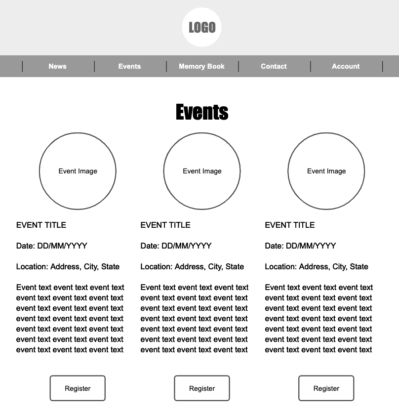

# Team Caleb

## Overview

Team Caleb is a non-profit organization in memory of Caleb Penn Maeir. This organization was designed to provide sports programs in underprivileged communities with the necessary funds and equipment to play the sports every child loves.

This web application is designed for users to register for upcoming TC events and post memories they have of Caleb. 

## Data Model

The application will store Events and Memories	

* Events can have multiple registered participants (individual objects)
* Memories can have authors (individual objects)
* Messages to the company

An Example Event:

```javascript
{
  title: "NYC Marathon",
  date: "2020-03-20T10:30:00.000Z",
  location: "New York, New York",
  participants: [], //an array of registered participant objects
  image: // an optional event image
  createdAt: // timestamp
}
```

An Example Memory:	

```javascript	
{	
  title: "First grade class",	
  author: "Rena Auerbach",	
  text: "I loved being in the same class as Caleb in first grade!",	
  createdAt: // timestamp  	
}	
```	

An Example Message:	

```javascript	
{	
  name: "Rena Auerbach",
  email: "renaauerbach@nyu.edu",	
  subject: "T-shirt size",	
  text: "Hi, I was wondering is the shirts for the Marathon run small? If so, I'd like to change mine to a Medium. Thank you!",	
  createdAt: // timestamp  	
}	
```	

## [Link to Commented First Draft Schema](db.js) 

## Wireframes

/events - page for viewing events



/events/register - page for registering for an event


/memories - page for viewing the memory book	

	

/memories/new - page for sharing a new memory 	


/contact - page for contacting the organization


## Site map


## User Stories or Use Cases

1. As a user, I can view the events page
2. As a user, I can register for an event
3. As a user, I can view the memory book page
4. As a user, I can author a new memory	
5. As a user, I can send a message to the organization via the contact page

## Research Topics

* (6-8 points) ReactJS
    * I'm going to use ReactJS as the frontend framework
	* I will create completely new views and components
	* I will learn how to pass data from the database into components

* Note: This was a MASSIVE undertaking. I have never configured a React frontend with any backend before. It took a TON of research and time. 

## [Link to Initial Main Project File](app.js) 

## Annotations / References Used

1. [React tutorial](https://reactjs.org/tutorial/tutorial.html)
2. [Creating a MERN Stack Application](https://blog.cloudboost.io/creating-your-first-mern-stack-application-b6604d12e4d3)
3. [Create React App](https://create-react-app.dev/)
4. [Server side rendering with React and Express](https://medium.com/front-end-weekly/server-side-rendering-with-react-and-express-382591bfc77c)
5. [How To Get Started with the MERN Stack](https://www.digitalocean.com/community/tutorials/getting-started-with-the-mern-stack#routes)
6. [The MERN Stack Tutorial](https://codingthesmartway.com/the-mern-stack-tutorial-building-a-react-crud-application-from-start-to-finish-part-1/)
7. [An Easy Way to Get Started with the MERN Stack](https://alligator.io/react/mern-stack-intro/)
8. [React Axios Tutorial](https://www.positronx.io/react-axios-tutorial-make-http-get-post-requests/)
