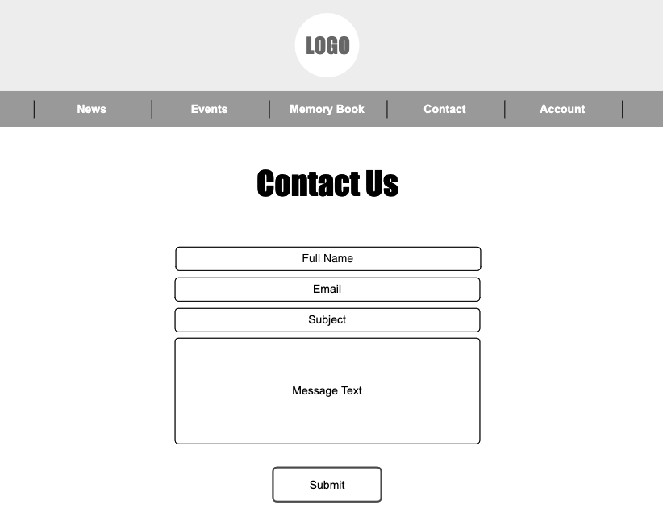

# Team Caleb

## Overview

Team Caleb is a non-profit organization in memory of Caleb Penn Maeir. This organization was designed to provide sports programs in underprivileged communities with the necessary funds and equipment to play the sports every child loves.

This web application is designed for users to register for upcoming TC events and post memories they have of Caleb. 

## Data Model

The application will store Users and Events.

* Users can register for multiple Events (via references)
* Events can have multiple registered Users (via reference)

An Example User with referenced Events:

```javascript
{
  username: "renaauerbach",
  hash: // a password hash,
  email: "rma453@nyu.edu",
  firstName: "Rena",
  lastName: "Auerbach",
  location: "Chicago, IL",
  events: [] // an array of references to Event documents
}
```

An Example Event with referenced Users:

```javascript
{
  title: "Jerusalem Marathon",
  date: "2020-03-20T10:30:00.000Z",
  location: "Jerusalem, Israel",
  users: [] //an array of references to Users 
  image: // an optional event image
  createdAt: // timestamp
}
```

## [Link to Commented First Draft Schema](db.js) 

## Wireframes

/news - page for viewing news from the organization


/events - page for viewing events


/events/register - page for registering for an event


/contact - page for contacting the organization



## Site map


## User Stories or Use Cases

1. As a non-registered user, I can register a new account with the site
2. As a non-registered user, I can view the news page
3. As a non-registered user, I can view the events page
5. As a non-registered user, I can contact the organization via the contact page
6. As a user, I can log in to the site
7. As a user, I can register for an event
8. As a user, I can view all the events I am registered for

## Research Topics

* (3 points) Grunt build tool
    * I'm going to be using Grunt for task automation in conjunction with the following:
	* (2 points) ESLint
	    * I will have a configuration file in my repository
	    * It will automatically run on entire codebase outside of node_modules on file change
	    * I will link it to relevant lines in build configuration and lint configuration
	    * I will show screen capture / animated gif of running on save
* (5 points) ReactJS
    * I'm going to use ReactJS as the frontend framework

## [Link to Initial Main Project File](app.js) 

## Annotations / References Used

1. [React tutorial](https://reactjs.org/tutorial/tutorial.html)
2. [Creating a MERN Stack Application](https://blog.cloudboost.io/creating-your-first-mern-stack-application-b6604d12e4d3)
3. [Create React App](https://create-react-app.dev/)
4. [Server side rendering with React and Express](https://medium.com/front-end-weekly/server-side-rendering-with-react-and-express-382591bfc77c)
